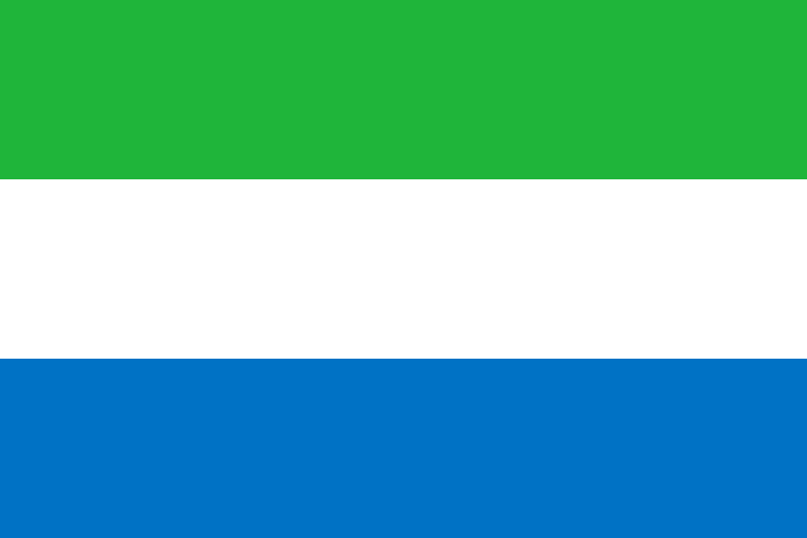

So that you at least get some vague impression where we go to and how beautiful Sierra Leone looks like we recommend you to check out these videos:

*	Visual impressions of the country:
    <iframe width="560" height="315" src="https://www.youtube.com/embed/HAW7henT7A8" frameborder="0" allow="accelerometer; autoplay; encrypted-media; gyroscope; picture-in-picture" allowfullscreen></iframe>
*	Some interesting facts about the country:
    <iframe width="560" height="315" src="https://www.youtube.com/embed/KyDsN0Z5mmY" frameborder="0" allow="accelerometer; autoplay; encrypted-media; gyroscope; picture-in-picture" allowfullscreen></iframe>

#### Or start by reading what Wikipedia has to say about it:
“Sierra Leone officially the Republic of Sierra Leone, informally Salone, is a country on the southwest coast of West Africa. It has a tropical climate, with a diverse environment ranging from savanna to rainforests. The country has a total area of 71,740 km2 (27,699 sq mi) and a population of 7,075,641 as of the 2015 census. Sierra Leone is a constitutional republic with a directly elected president and a unicameral legislature. The country's capital and largest city is Freetown. Sierra Leone is made up of five administrative regions: the Northern Province, North West Province, Eastern Province, Southern Province and the Western Area. These regions are subdivided into sixteen districts.

Sierra Leone was a British Crown Colony from 1808 to 1961. Sierra Leone became independent from the United Kingdom on 27 April 1961, led by Sir Milton Margai, who became the country's first prime minister. In May 1962, Sierra Leone held its first general elections as an independent nation. On 19 April 1971, Siaka Stevens' government abolished Sierra Leone's parliamentary government system and declared Sierra Leone a presidential republic. From 1978 to 1985, Sierra Leone was a one-party state in which Stevens' APC was the only legal political party in the country. The current constitution of Sierra Leone, which includes multiparty democracy, was adopted in 1991 by the government of President Joseph Saidu Momoh, Stevens' hand-picked successor. On 23 March 1991, a rebel group known as the Revolutionary United Front led by a former Sierra Leone army officer Foday Sankoh launched an eleven-year brutal civil war in the country, in an unsuccessful attempt to overthrow the Sierra Leone government.

In April 1992, a group of junior army officers in their twenties overthrew president Momoh from power, and their leader a 25 year old captain Valentine Strasserbecame the world's youngest Head of State. In January 1996 Brigadier General Julius Maada Bio returned the country to multi-party democracy and the 1991 constitution was reestablished. Bio handed power to Ahmad Tejan Kabbah after his victory in the 1996 Sierra Leone presidential election. In 1997, the military overthrew President Kabbah. However, in February 1998, a coalition of West African Ecowas armed forces led by Nigeria removed the military junta from power by force and President Kabbah was reinstated as president. Sierra Leone has had an uninterrupted democracy from 1998 to present. In January 2002, President Ahmad Tejan Kabbah fulfilled his campaign promise by officially ending the civil war as the rebels were defeated by military force with the help and support of Ecowas, the British government, the African Union, and the United Nations.

16 ethnic groups inhabit Sierra Leone, each with its own language and customs. The two largest and most influential are the Temne and Mende. The Temne are predominantly found in the northwest of the country, and the Mende are predominant in the southeast. Comprising a small minority, about 2%, are the Krio people, who are descendants of freed African-American and West Indian slaves. Although English is the official language, used in schools and government administration, Krio, an English-based creole, is the most widely spoken language across Sierra Leone and is spoken by 98% of the country's population. The Krio language unites all the different ethnic groups in the country, especially in their trade and social interaction.

Sierra Leone is a Muslim-majority country at about 78%, though there is an influential Christian minority at 21%. Sierra Leone is regarded as one of the most religiously tolerant states in the world. Muslims and Christians collaborate and interact with each other very peacefully, and religious violence is very rare. The major Christian and Muslim holidays are officially public holidays in the country, including Christmas, Easter, Eid al-Fitr and Eid al-Adha 

Sierra Leone has relied on mining, especially diamonds, for its economic base. It is also among the largest producers of titanium and bauxite, is a major producer of gold, and has one of the world's largest deposits of rutile. Sierra Leone is home to the third-largest natural harbour in the world. Despite this natural wealth, 53% of its population lived in poverty in 2011. Sierra Leone is a member of many international organisations, including the United Nations, the African Union, the Economic Community of West African States (ECOWAS), the Mano River Union, the Commonwealth of Nations, the African Development Bank and the Organisation of Islamic Cooperation.” 

(https://en.wikipedia.org/wiki/Sierra_Leone)

### Language
While the official language is English, the spoken language that many citizens speak is Krio. It is quite amusing to listen to it:
<iframe width="560" height="315" src="https://www.youtube.com/embed/WtMM6YzHdZM" frameborder="0" allow="accelerometer; autoplay; encrypted-media; gyroscope; picture-in-picture" allowfullscreen></iframe>

Or some handy proverbs ;-)
<iframe width="560" height="315" src="https://www.youtube.com/embed/5NugAHBCXdQ" frameborder="0" allow="accelerometer; autoplay; encrypted-media; gyroscope; picture-in-picture" allowfullscreen></iframe> 
<iframe width="560" height="315" src="https://www.youtube.com/embed/_wW2oCHFjsk" frameborder="0" allow="accelerometer; autoplay; encrypted-media; gyroscope; picture-in-picture" allowfullscreen></iframe>
<iframe width="560" height="315" src="https://www.youtube.com/embed/8Dfn7HSnS1w" frameborder="0" allow="accelerometer; autoplay; encrypted-media; gyroscope; picture-in-picture" allowfullscreen></iframe>